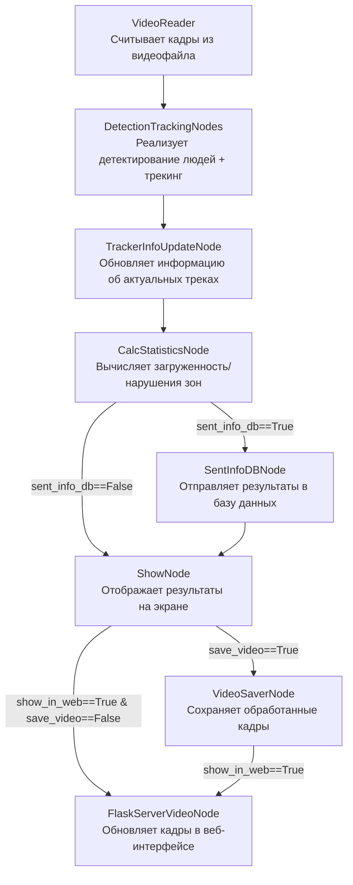

# Оценка количества людей в зоне

Данная программа осуществляет оценку количества людей в зоне. Алгоритм определяет загруженность/нарушения зон и выводит интерактивную статистику.


## Установка:
Необходима версия Python >= 3.10 (лучше 3.10.14)
```
pip install torch==2.3.1 torchvision==0.18.1 --index-url https://download.pytorch.org/whl/cu121
pip install -r requirements.txt
```
## Работа с программой:
Перед запуском необходимо в файле __configs/app_config.yaml__ указать все желаемые параметры. Далее можно запускать код.

Классический запуск кода:
```
python main.py
```
Пример запуска в дебаг режиме (профилировщик):
```
python main.py hydra.job_logging.root.level=DEBUG
```
---

Оптимизированный код с помошью multiprocessing позволяет добиться более высокой скорости обработки (>30 fps). Для его запуска необходимо запустить терминальную команду:
```
python main_optimized.py 
```
Для тестирования работы проекта в репозитории уже имеется видео test_videos/test2.mp4. 


Чтобы запустить проект с определенным видео, необходимо указать путь к нему в файле конфигурации configs/app_config.yaml проекта в разделе video_reader.src.

---
## Примеры работы кода:


---

## Вывод обработанного видеопотока в веб-интерфейс:

Обработанные кадры можно отображать в веб-интерфейсе (вместо отдельного окна OpenCV). Бэкенд сайта реализован с использованием Flask.

Для того, чтобы запустить проект таким образом, необходимо в файле configs/app_config.yaml в разделе pipeline указать show_in_web=True и в show_node указать imshow=False. Далее можно запускать main.py или main_optimized.py и переходить по ссылке http://localhost:8100/


---

## Существующие версии кода:

В проекте специально предусмотрено множество веток, реализующих разные уровни разработки масштабного Computer Vision проекта.

В главной ветке [**main**]() Docker Compose позволяет поднять сторонние сервисы (Grafana для визуализации и базу данных PostgreSQL). Однако основной код, реализующий бекенд, необходимо запускать локально с помощью имеющегося на компьютере Python.

Дальнейшее развитие проекта заключается в реализации полного Docker Compose из всех имеющихся сервисов, включая сам бекенд. 


---

## Рассмотрим, как реализован код:

Каждый кадр последовательно проходит через ноды, и в атрибуты этого объекта постепенно добавляется все больше и больше информации.


